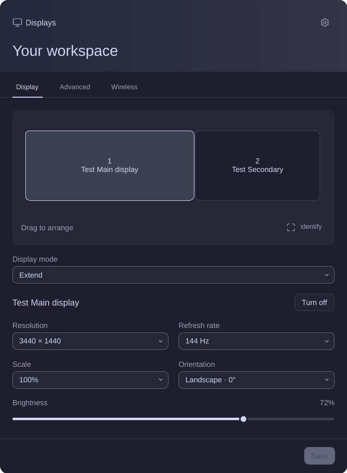

# Foamy Monitor

Display arrangement, monitor controls, and wireless casting.



## Install

For wireless casting, install FluxCast (`fluxcast-git`) and FFmpeg (`ffmpeg`).

```sh
omarchy plugin add https://github.com/foamrider/foamy-monitor.git --enable
```

Use one display-control plugin at a time; disable any previous local replacement.

## Use

- Left-click the widget to open display controls. Select a display or drag it into position.
- Use **Display** for resolution, refresh rate, scale, orientation, and brightness.
- Use **Advanced** for text size, cursor size, and GTK scale.
- Use **Wireless** to find a receiver and cast the selected display.
- Open the cog to change language. Plugin preferences are stored in `shell.json`.

**Save** starts a 15-second trial. Choose **Keep settings** to save, or **Revert**
to restore the previous configuration. The trial also reverts if it times out.
Brightness, text size, and cursor size apply immediately.

## License

Licensed under [MIT](LICENSE), with [Monitor Settings Extender](LICENSE-MONITOR-SETTINGS-EXTENDER),
[Omarchy](LICENSE-OMARCHY), and [Lucide](LICENSE-LUCIDE) notices.

Provided **as is**, without warranty or guaranteed support. Use at your own risk.
